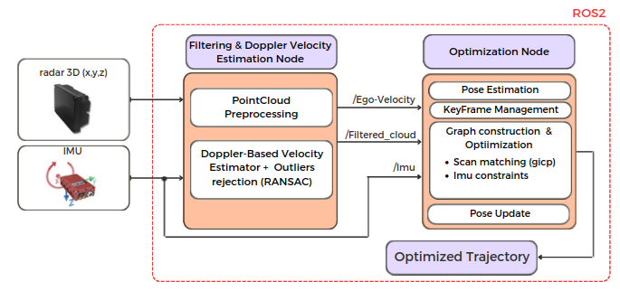

# Radar based odometry for Ground Vehicles

**Radar_Odom** is an open-source ROS2 Humble package designed to estimate the trajectory of a ground vehicle equipped with a 4D radar (x, y, z, Doppler) and an IMU. It is a 3D odometry system aimed at contributing to the development of odometry algorithms in adverse situations where commonly used sensors such as LiDAR, cameras, etc., are not applicable, for instance, in environments with fog or rain in 3D scenarios.

## 1. Dependencies

### System Requirements:
- **Ubuntu 22.04 (Jammy)**
This package depends on several libraries and ROS2 packages. Below is a list of the required packages and libraries:

### ROS2 Packages:
- `ament_cmake`
- `rclcpp`
- `geometry_msgs`
- `nav_msgs`
- `sensor_msgs`
- `tf2_eigen`
- `pcl_conversions`
- `pcl_ros`
- `tf2_ros`
- `tf2_geometry_msgs`

### External Libraries:
- **Eigen3**
- **OpenCV**
- **Ceres**
- **angles**
- **PCL**
## 2. System Structure

The `Radar_Odom` package is structured around two main nodes that work together to estimate the vehicle's trajectory using radar and IMU data.

### 1. Filtering & Doppler Velocity Estimation Node
This node processes data from both the radar and the IMU. It performs several tasks:
- **PointCloud Preprocessing**: Prepares and filters the raw radar data.
- **Doppler-Based Velocity Estimation**: Estimates the vehicle's ego-velocity by leveraging the Doppler effect detected at radar points.
- **Outliers Rejection**: Uses techniques like RANSAC to detect and exclude non-physically feasible movements and dynamic objects (e.g., moving vehicles or pedestrians), ensuring only static elements contribute to the final velocity estimation.

### 2. Optimization Node
Once the radar and IMU data have been refined, this node handles:
- **Pose Estimation**: Using the ego-velocity and filtered data, the node estimates the vehicle's pose.
- **KeyFrame Management**: Manages key frames and ensures optimization over a sliding window.
- **Graph Construction & Optimization**: Builds and optimizes a graph of the vehicle's poses using scan matching (GICP) and IMU constraints.

This process ensures the vehicle's trajectory is continuously updated and optimized. The nodes work together to provide accurate pose estimation even in challenging environments where traditional sensors may not perform well.

Below is a flow diagram illustrating the system structure:

  

